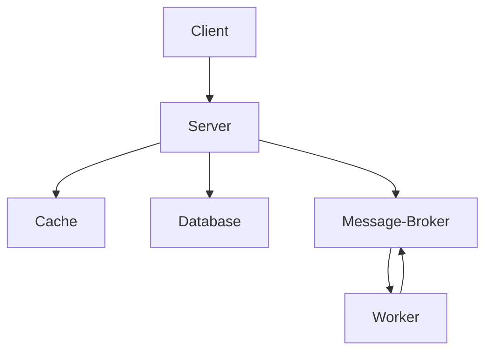
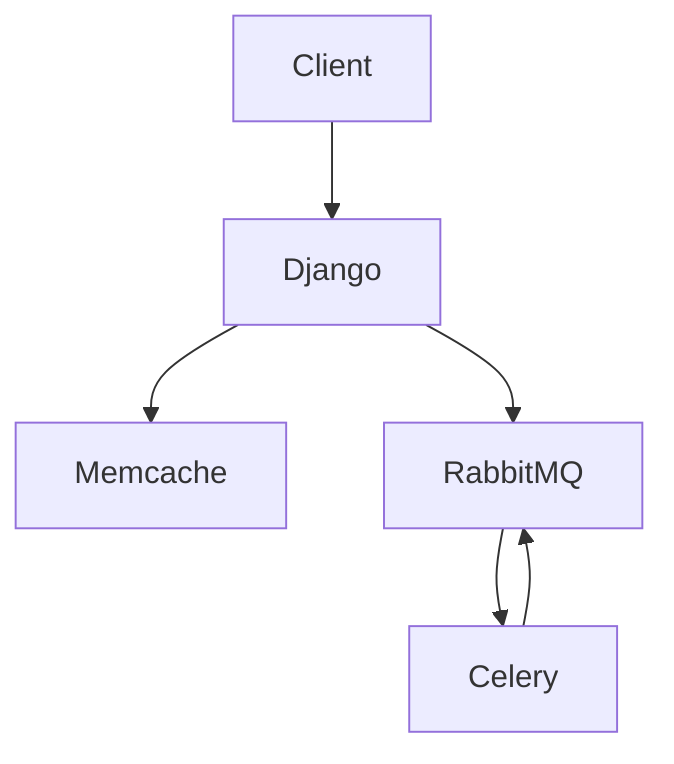

# A basic linear algebra interpreter web service
A small social media website.

- The user can make friends with other users

- Includes an activity stream application, i.e., news feed

- Asynchronous email notification when a user receives a friend request

- The user can make basic linear algebra computations over the network

  - This includes an interpreter; this language system parsers basic linear algebra expressions and evaluates it.

## Running the program

### Dependencies
#### docker
```
sudo pacman -S docker
```

#### RabbitMQ
```
docker pull rabbitmq
```

#### Celery
```
sudo pacman -S python-celery
```
#### Redis
```
$ docker pull redis
$ pip install redis ;; or
$ sudo pacman -S python-redis
```

#### Memcache
```
$ docker pull memcached
$ sudo pacman -S python-pymemcache ;; or
$ pip install pymemcache
```

### Required servers

#### Django
```
python manage.py runserver
```

#### RabbitMQ
```
sudo docker run -d --rm --name rabbitmq -p 5672:5672 -p 15672:15672 rabbitmq:management
```

#### Celery
```
celery -A server worker -l info
```

#### Redis
```
docker run -it --rm --name redis -p 6379:6379 redis
```

#### Memcached
```
docker run -it --rm --name memcached -p 11211:11211 memcached -m 64
```
### Usage
You can use the python client in `src/python_client/client.py` to call the api.

Once you have at least a user or two you can use the bash script in `src/server/call_api.sh` but you will need to replace the user `jobpink` and the password with a new user of your choice.

To run the bash script:

```
$ chmod +x call_api.sh
$ ./call_api.sh
```

## Architecture
The architecture consists of a server that gets data in a cache if the data is in the cache otherwise it gets data from a database; moreover, it consists of a message broker, and a worker server that gets the messages from the message queue that the broker manages. By using the cache, in theory, we improve the performance and by using the message broker and worker we process asynchronous tasks such as sending an email notification to a given user who has received a friend request; this setup can also be used to send notifications to the user whose post has been liked.



Specifically, the architecture consists of this:


